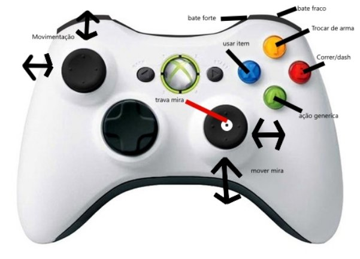

# fabrica-de-projeto
 Jogo da fabrica de projeto

# HIGH-CONCEPT  For the honor of God

RPG 2D com foco em movimentação, medieval, objetivo matar bosses.

## RPG, Aventura, Ação

Inspirado em jogos como: The Legend of Zelda: A Link to the Past e a serie Darksouls. For the Honor of God é um RPG 2D com foco em movimentação estilo medieval onde o objetivo do jogo é avançar pelo mapa, explorando os seus segredos, enfrentando inimigos, e derrotando chefes.

## Movimentação rapida com camera de cima para baixo
Rolamento para fugir de ataques,
Defesa com escudo que diminui o dano mas não o zera,
ataque a distancia com lança e cajado,
ataque melee com espada.

## Historia

Em busca de acabar com o invasor do reino. Controle o melhor cavaleiro templário do mundo, e enfrente demônios, até chegar a raiz do mal. 

## Diferencial

Boa otimização.
Sistema de conquistas recompensando o jogador.
História inédita.
Sistema de comunicação dentro do próprio jogo, onde outros jogadores podem deixar dicas por onde passaram a outros que vão passar por ali ainda.

##  Sistema operacional:

Windows com suporte a controle
Android(incerteza)

##  Público alvo e classificação indicativa
Pessoas que gostam de jogos de RPG mas que não possuem um computador com grande processamento gráfico para joga-lo, 14 anos

## Previsão de Lançamento
Lançamento: Inverno de 2023

# GDD For the honor of God
7

")
For the honor of God

Para Windows 

Classificação: 14

Data de Lançamento: Inverno 2023

História do jogo:

O comando de ataque já foi dado. O reino está em sérios riscos de ataque. Mas o inimigo, não vira da terra. A igreja fala com o rei, e pede o chamado dos cavaleiros templários, porém, o rei está séptico, e a ordem é, não atacar. Um padre foge e manda uma mensagem aos templários, vocês não poderão usar seu exército, mas, um guerreiro só não é um exército. E Assim em um ato de bravura, eles mandam o seu melhor guerreiro, para tentar deter o grande inimigo.

Gameplay:

Com uma movimentação super dinâmica, For the honor of God é um jogo com câmera vista de cima para baixo, onde é necessário ter reflexos rápidos para desviar de ataques vindos de todas as direções e de vários inimigos diferentes (as vezes ao mesmo tempo).

Personagem do jogador:

No jogo, você controlara um cavaleiro templário, um guerreiro de grande fé em Deus. A cada inimigo derrotado, é uma alma a menos que é perdida para o inferno, e Deus se agradando disso te dá vários benefícios como bônus.

Porém, o principal inimigo do jogo também é forte, e além disso, ele é ardiloso, retira as suas forças de suas tropas, derrote-as, e ganhe armas adicionais que podem mudar totalmente a maneira com que você joga e, também te dar habilidades adicionais, te tornando mais parecido com o inimigo. 

Controles do jogador:

De acordo com o estudo de prioridade de comandos, tentamos elaborar a melhor forma para os comandos não se chocarem e o jogador conseguir fazer todos os movimentos que precisar fluírem de uma maneira solida.Experiencia de jogo:

Viva como um cavaleiro templário. Use de toda a sua fé para derrotar todo tipo de criatura vindas do inferno.

Explore: Procure segredo pelo mapa. Existem passagens secretas por todo o mapa, podendo levar para novos inimigos ou até para baús que te darão itens únicos.

Descanse: Sente-se em uma fogueira quentinha para recuperar as suas forças e fazer as suas rezas, pedindo ajuda de Deus.

Coma Carne: É ISSO MESMO, cace animais pelo mundo, sente-se na fogueira e aproveite uma boa carne.

Enfrente Chefes: Em alguns locais determinados, você será desafiado por comandante do exército de seu inimigo, esses, são os chefes. As batalhas contra eles serão longas e difíceis pois eles têm muita vida e tem alta capacidade de dar dano. Caso você o derrote, você será contemplado com uma super benção.

Mecânicas de Jogo:

O jogo em For the honor of God é em uma vista isométrica de personagens, elementos e visão em 2D. A câmera pode ser aproximada focada no player e em mais um inimigo ao mesmo tempo, com um limite de distância entre os dois. O jogador percorre o mapa em tempo real, lutando contra inimigos. Os jogadores de For the honor of God executam varias ações ao mesmo tempo, onde precisam as vezes desviar de vários ataques vindos de vários inimigos diferentes, e depois tendo que atacá-los. No curso do jogo, os controles continuam contextuais – tecnologias avançadas e melhorias de armas utilizam o mesmo esquema básico de controle. Após cada batalha, é recebido um certo número de bênçãos que pode ser trocado por pontos de atributos em uma fogueira.

Inimigos:

Esqueleto: Almas que saíram do inferno e possuíram esqueletos só para te atormentar, elas são frágeis, mas tem um dano médio,

Podem tentar te pegar de surpresa.

Diabrete espada: O soldado do tinhoso, é literalmente um diabinho, ele tem vida e dano equilibrados, cuidado para não ser pego por um bando deles.

Diabrete arco: O irmão do soldado do tinhoso, assim como seu irmão, ele é literalmente um diabinho, só que com um arco, o que por algum motivo faz ele ter menos vida, mas te dar mais danos. Normalmente ele vai ficar te atazanando de longe.

Servo: É um ser humano que serve ao tinhoso, como faz por merecimento, ele é mais forte que o Diabrete. Normalmente atacara sozinho. Pode atacar tanto de espada quanto de arco. Cuidado, eles são mais inteligentes.

Javali enfurecido: Não tem nada a ver com o tinhoso, só ficou bravo por você invadir o território dele. São fracos e burros, mas atacam em grandes bandos, se entrar no lugar errado pode não gostar do que vai encontrar.

For The Honor of God                       <eduardomartimiano@hotmail.com>                                       05/2022
